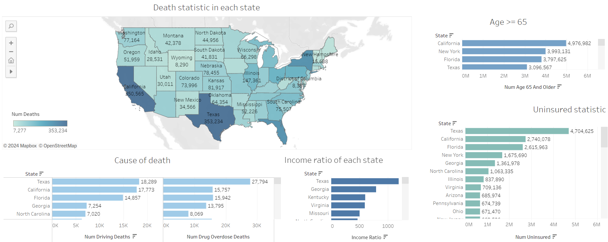

# US County Sociohealth Dashboard (Tableau)

#### Tableau Dashboard Link : https://public.tableau.com/app/profile/cornelius.karel.halim/viz/DMV_LAB_simpleImputed/Dashboard1
#### Dataset Link : https://www.kaggle.com/datasets/johnjdavisiv/us-counties-covid19-weather-sociohealth-data?select=us_county_sociohealth_data.csv

## Description 

This project leverages socio-economic, health, and COVID-19 data from U.S. counties to provide insights into the interdependencies between public health outcomes, demographics, and socio-economic factors. The dataset explores metrics like COVID-19 cases, health insurance coverage, income disparities, and other demographic indicators such as the elderly population, which offer a detailed view of vulnerabilities at the county level. Understanding these factors allows policymakers to prioritize resource allocation and health interventions where they are needed most, especially during pandemics or public health crises.

## Business Problem 

The COVID-19 pandemic exposed socio-economic and healthcare disparities across US states, with high senior populations, uninsured rates, and income disparities driving the risk of death. Insurance companies have the opportunities to improve health care access through expanding insurance, addressing drug-related deaths, and preparing for elderly care needs provides opportunities to reduce preventable deaths and strengthen public health systems. Prioritizing interventions in high-risk countries can improve outcomes and ensure better pandemic preparedness.

## Dashboard 

- Map Visualization: State-level death statistics.
- Bar Charts: Breakdown by age 65+, uninsured population, and specific causes of death (drug overdoses, driving fatalities).
- Income Ratio: Comparison of income disparity between states, highlighting financial inequality as a public health factor.

## Insights
- Death Statistics: Texas and California reported the highest number of deaths, exceeding 350,000.
- Demographics: California, New York, and Florida lead the way in terms of population aged 65+, with millions of people in this age group, creating healthcare challenges.
- Uninsured Population: Texas has the highest number of uninsured people, more than 4.7 million, which may correlate with preventable deaths.
- Cause of Death: Drug overdose deaths are very common in Texas, with more than 27,000 cases. Driving-related deaths also show high numbers in Texas and California.
- Income Ratio: States like Texas and Georgia report high income disparities, which are potentially related to disparities in healthcare access.

## Business Recommendations
- Targeted Health Insurance Programs: States like Texas and Florida should introduce programs to reduce the rate of uninsured people.
- Public Awareness Campaigns: States at high risk for drug overdoses (e.g. Texas) should focus on prevention education and treatment access.
- Elder Care Planning: States with high populations and aging populations (California, New York) need improved healthcare infrastructure to support future demand.
- Road Safety Initiative: Focus on reducing driving deaths through stricter law enforcement and driver education campaigns.
